# Analiza ranjivosti, napada i mitigacija za Angular radni okvir

## Deo sistema koji se analizira
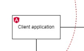

## Angular
Angular je open-source front-end radni okvir koji razvija i održava Google. Olakšava kreiranje dinamičkih, single-page web aplikacija pružajući veliki skup alata i biblioteka. Angular koristi deklarativni pristup za izgradnju korisničkih interfejsa, naglašavajući modularnost i kreiranje 'reusable' komponenti. Koristi TypeScript kao svoj primarni programski jezik. Arhitektura Angulara podržava two way data binding, dependency injection i modularnu strukturu, što ga čini moćnim okvirom za razvoj složenih i skalabilnih aplikacija.
U nastavku slede opisi 3 ranjivosti koje se mogu naći u sistemima koji koriste Angular radni okvir.

## CVE-2023-45133 - Arbitrary Code Execution
U računarskoj bezbednosti, Arbitrary Code Execution je sposobnost napadača da pokrene bilo koju komandu ili kod po izboru napadača na ciljnoj mašini ili u ciljnom procesu. Ranjivost izvršenja proizvoljnog koda je bezbednosna greška u softveru ili hardveru koja omogućava izvršenje proizvoljnog koda.

### Uvod
Babel je alat koji se uglavnom koristi za konvertovanje koda [ECMAScript 2015+] u unazad kompatibilnu verziju JavaScript-a za trenutne i starije pregledače ili okruženja.

Babel postavlja "jastuk" između web aplikacije i mnogih novih formata datoteka razvijenih za upotrebu sa node.js-om, kao što su CoffeeScript, SASS i Jade. Sa Babel-om, mogu se bez problema učitavati različite vrste datoteka.

Karakteristike:
- Lako učitavanje "stylesheets"-a, podataka, šablona i skripti iz mnogih popularnih formata
- Eksperimentisanje sa različitim formatima s lakoćom

Babel je kompajler za pisanje JavaScript-a. U @babel/traverse pre verzija 7.23.2 i 8.0.0-alpha.4 i svih verzija babel-traverse, korišćenje Babela za kompajliranje koda koji je posebno kreiran od strane napadača može dovesti do proizvoljnog izvršavanja koda tokom kompajliranja, prilikom korišćenja dodataka koji se oslanjaju na interne Babel metode path.evaluate() ili path.evaluateTruthy().

Poznati pogođeni plugin-i su @babel/plugin-transform-runtime; @babel/preset-env kada se koristi njegova opcija useBuiltIns; i bilo koji "polifil provajder" dodatak koji zavisi od @babel/helper-define-polyfill-provider, kao što su babel-plugin-polyfill-corejs3, babel-plugin-polyfill-corejs2, babel-plugin-polyfill-es-shims, babel-plugin-polyfill-regenerator. Nijedan drugi plugin pod @babel/ imenskim prostorom nije pogođen, ali third party plugins mogu biti. 

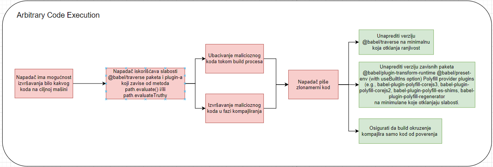

### Vulnerability(CVE-2023-45133)
CVE-2023-45133 je kritična bezbednosna ranjivost koja se nalazi u @babel/traverse paketu Babel-a, popularnog JavaScript kompajlera. 
Ova ranjivost se posebno javlja kada Babel kompajlira kod koji je zlonamerno napravio napadač. Srž problema leži u internim metodama path.evaluate() i path.evaluateTruthi(), koje Babel koristi za evaluaciju koda tokom procesa kompilacije. 
Pogođene verzije obuhvataju sve verzije babel-traverse i @babel/traverse pre 7.23.2 i 8.0.0-alpha.4. 
Određeni Babel dodaci koji zavise od ovih metoda su posebno ranjivi, uključujući @babel/plugin-transform-runtime, @babel/preset-env (kada koristite opciju useBuiltIns) i razne dodatke dobavljača polifila kao što su babel-plugin-polifill-corejs3, babel-plugin-polifill-corejs2, babel-plugin-polifill-es-shims i babel-plugin-polifill-regenerator. Ranjivost ne utiče na vreme izvršavanja aplikacija, ali predstavlja značajnu pretnju tokom procesa izgradnje, potencijalno dozvoljavajući proizvoljno izvršavanje koda na mašini programera.

### Attack - Exposure
Izloženost ovoj ranjivosti prvenstveno se javlja tokom faze izrade aplikacije, gde se Babel koristi za kompajliranje JavaScript koda. 
Napadač može da iskoristi ovu ranjivost uvođenjem zlonamerno kreiranog koda u proces pravljenja. 
Ovaj kod, kada ga obrađuje ranjiva verzija @babel/traverse zajedno sa pogođenim dodacima, može dovesti do proizvoljnog izvršavanja koda. 
Ovo izvršenje se dešava unutar okruženja za kompilaciju, što potencijalno dovodi do kompromitovanja celog sistema izgradnje. 
Rizik je posebno visok u okruženjima u kojima se kompajlira nepouzdani kod, jer zlonamerni kod ne mora da bude deo vremena izvršavanja aplikacije da bi bio efikasan. Važno je napomenuti da iako je direktan uticaj na razvojno okruženje, posledice se mogu proširiti na integritet i bezbednost čitavog životnog ciklusa aplikacije.

### Mitigation
Da bi se ublažili rizici koje predstavlja CVE-2023-45133, trebalo bi primeniti nekoliko strategija. 
Primarna i najefikasnija mera je ažuriranje paketa @babel/traverse na bezbednu verziju – bilo verziju 7.23.2 ili 8.0.0-alpha.4, koje sadrže ispravke za ovu ranjivost. 
Pored toga, svi dodaci na koje se to odnosi treba da budu ažurirani na njihove najnovije verzije.
Integracija alata nezavisnih proizvođača dizajniranih za skeniranje npm paketa je značajan dodatni korak. 
Ovi alati mogu automatski analizirati ponašanje i integritet paketa i njihovih zavisnosti. 
Oni služe kao sistem ranog upozorenja za otkrivanje potencijalno zlonamernih ili ranjivih paketa pre nego što budu integrisani u proces razvoja. 
Ovaj proaktivni pristup dodaje dodatni sloj bezbednosti tako što osigurava da se sve komponente izgradnje pažljivo proveravaju u pogledu bezbednosnih rizika, čime se smanjuje verovatnoća nenamernog unošenja ranjivosti u sistem.
Ove ispravke zatvaraju ranjive putanje koda i sprečavaju iskorišćavanje ove ranjivosti. 
Programeri takođe treba da usvoje praksu redovne revizije i ažuriranja svojih zavisnosti kako bi osigurali da ranjive verzije ne ostanu u njihovim razvojnim okruženjima. Štaviše, ključno je uspostaviti siguran razvojni proces koji uključuje kompajliranje samo koda od poverenja, posebno u okruženjima za izgradnju gde je moguće uvođenje nepouzdanog koda. 
Primenom ovih strategija ublažavanja, rizik od eksploatacije kroz ovu ranjivost može se značajno smanjiti, čuvajući razvojno okruženje i opšti integritet aplikacije.

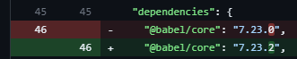

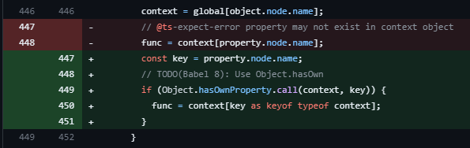

## CVE-2017-16026 - Remote Memory Exposure
Remote Memory Exposure je vrsta ranjivosti gde napadač može da dobije neovlašćeni pristup osetljivim informacijama uskladištenim u memoriji sistema. 

Ova ranjivost se često javlja u umreženim aplikacijama kada nenamerno pošalju neinicijalizovani memorijski sadržaj udaljenom korisniku. 

Ovo se može desiti zbog grešaka u programiranju, kao što je neuspeh inicijalizacije bafera ili slanje više podataka nego što je predviđeno. 

Izložena memorija može da sadrži poverljive podatke kao što su lozinke, ključevi za šifrovanje ili lične korisničke informacije, što predstavlja značajan bezbednosni rizik.

Napadači koji iskorišćavaju ovu ranjivost mogu potencijalno čitati osetljive podatke sa servera, što dovodi do kršenja podataka ili daljeg kompromitovanja sistema. 

Za programere je ključno da osiguraju da njihov kod pravilno inicijalizuje i upravlja memorijom, kao i da implementiraju bezbednosne provere kako bi sprečili takve ranjivosti.

#### Input Validation
Kategorija „ranjivosti“ u kontekstu validacije unosa odnosi se na slabosti ili bezbednosne propuste koji mogu nastati kada sistem pravilno ne validira, sanira ili proverava podatke koje prima. 
Ova kategorija je ključna za sajber bezbednost jer nepropisno potvrđeni ulazi mogu dovesti do niza problema, kao što su SQL injection, cross-site scripting (XSS), prekoračenje bafera i druge vrste napada. 
Ove ranjivosti se javljaju kada aplikacija prihvati unos bez adekvatne provere da li je bezbedan, potencijalno dozvoljavajući zlonamernim akterima da manipulišu sistemom, pristupe osetljivim podacima ili ometaju usluge. 
Efikasna validacija unosa je neophodna za sprečavanje ovih ranjivosti i zaštitu sistema od različitih oblika eksploatacije.

### Uvod
Request je npm paket dizajniran da bude najjednostavniji mogući način za upućivanje http poziva.

### Vulnerability(CVE-2017-16026)
CVE-2017-16026 je ranjivost u vezi sa Request HTTP klijentom. 

Ranjivost se javlja kada je zahtev napravljen pomoću multipart body-a, a tip body-a je broj.

U takvim slučajevima, određeni broj memorijskih bajtova koji nije nula se prosleđuje u telu zahteva. 

Ovaj problem utiče na verzije Zahteva od 2.2.6 do 2.47.0 i od 2.51.0 do 2.67.0

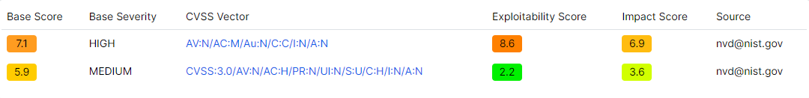

#### Manifestacija Ranjivosti
Nenamerna Transmisija Podataka: 
- Ranjivost se manifestuje tako što HTTP klijent nenamerno šalje delove server memorije kao odgovor na određene zahteve. Ovo može da se dogodi bez bilo kakvog evidentnog greške ili upozorenja, čineći izlaganje podataka tiho i stoga opasnije.

Iskorišćavanje od strane Napadača: 
- Napadač koji je svestan ove ranjivosti može napraviti specifične HTTP zahteve da iskoristi ovu slabost. Mogli bi potencijalno automatizovati ovaj proces da izvuku velike količine podataka tokom vremena.

Nepredvidljivi Izlaz:
- Priroda i količina izloženih podataka može varirati u zavisnosti od stanja aplikacije i upotrebe memorije. Ova nepredvidljivost dodaje riziku jer je teško odrediti koji podaci mogu biti procurili u bilo kom trenutku.

### Attack - Exposure

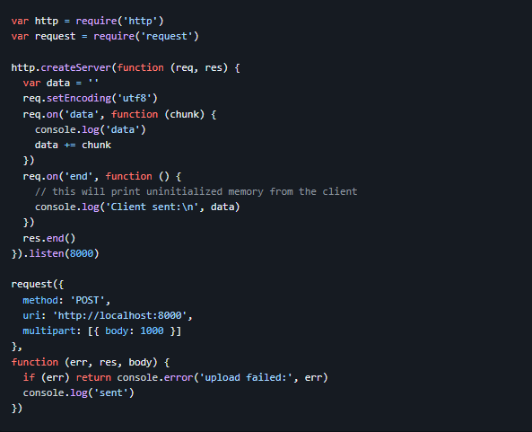

Napomena da, iako je uticaj ove ranjivosti visok (izlaganje memorije), iskorišćavanje je verovatno teško, jer napadač mora nekako kontrolisati tip tela zahteva. Jedan potencijalni scenario iskorišćavanja je kada se zahtev sastavlja na osnovu JSON ulaza, uključujući tip tela, omogućavajući zlonamernom JSON-u da pokrene curenje memorije.

Posledice Remote Memory Exposure-a

Curenje Podataka: 
- Osnovna posledica je nenamerno izlaganje osetljivih podataka koji se čuvaju u memoriji. To može uključivati lozinke, lične informacije, detalje konfiguracije sistema ili bilo koje druge podatke uskladištene u memorijskom prostoru aplikacije.

Gubitak Poverljivosti: 
- Pošto ranjivost može izložiti osetljive informacije, direktno krši poverljivost. Ovo može biti posebno štetno ako izloženi podaci uključuju korisničke akreditive ili poslovne informacije.

Potencijal za Dalje Iskorišćavanje: 
- Izloženi sadržaj memorije može pružiti napadačima dodatne informacije korisne za dalje napade, kao što su detalji arhitekture sistema, interna stanja aplikacije ili čak pokazatelji na druge ranjivosti.

Pravni i Problemi Usaglašavanja: 
- Ako izlaganje podataka uključuje lične podatke, organizacija može suočiti sa pravnim kaznama i problemima neusklađenosti prema regulativama zaštite podataka kao što su GDPR ili HIPAA.

### Mitigation
Patching i Ažuriranja: 
- Nadogradnja HTTP klijenta za zahteve na patched verziju (2.68.0 ili višu) je ključna za ublažavanje ove ranjivosti.

Validacija Unosa: 
- Osiguranje pravilne validacije svih ulaznih podataka, posebno u aplikacijama koje se suočavaju sa mrežom, može sprečiti mnoge slučajeve nepravilnog izlaganja memorije.

Redovne Bezbednosne Revizije: 
- Redovno reviziranje softvera za potencijalne ranjivosti i praćenje bezbednosnih ažuriranja od strane dobavljača i open-source projekata.

Nadzor i Detekcija Anomalija: 
- Implementacija alata za nadzor za detekciju neobičnih obrazaca mrežnog saobraćaja ili neočekivanih prenosa podataka koji bi mogli ukazivati na pokušaj iskorišćavanja.

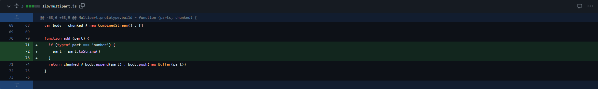

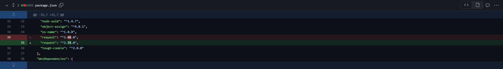

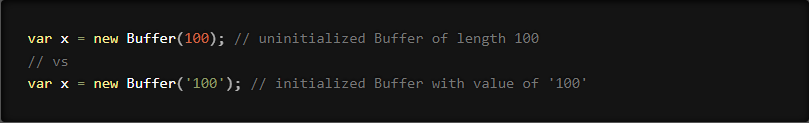

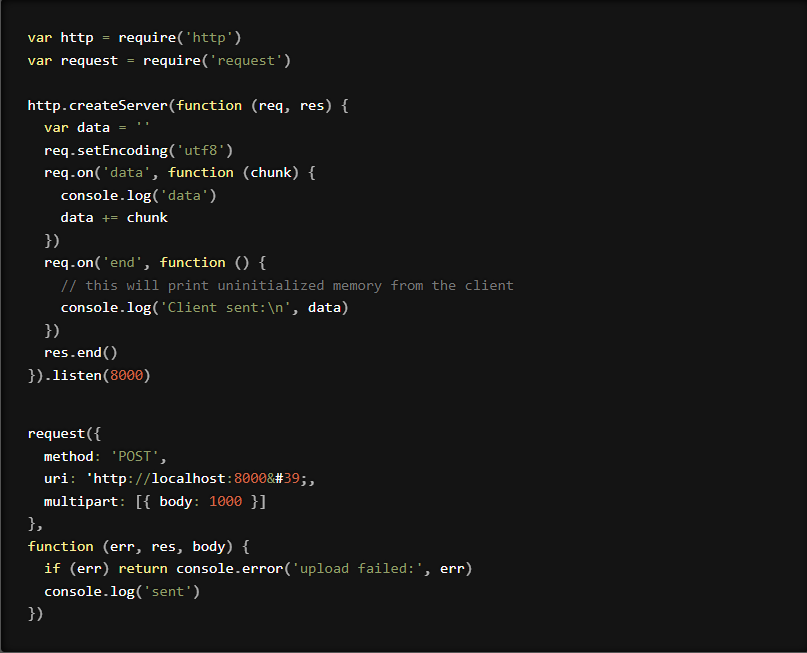

## CVE-2019-10747 - Prototype Pollution
Prototype Pollution je vrsta bezbednosne ranjivosti koja se javlja kada je napadač u mogućnosti da izmeni prototip objekta JavaScript aplikacije. U JavaScript-u, prototipovi se koriste kao nacrt za kreiranje objekata, a modifikacija prototipa može uticati na sve objekte koji od njega nasleđuju svojstva. Ova ranjivost se obično javlja kada aplikacija nepravilno rukuje unosom korisnika, dozvoljavajući napadačima da unesu svojstva u prototipove objekata aplikacije.

Iskorišćavanje ove ranjivosti može dovesti do različitih bezbednosnih problema, uključujući, ali ne ograničavajući se na manipulaciju logikom aplikacije, uskraćivanje usluge i u nekim slučajevima, Remote Code Execution-a. 
Rizik je posebno visok u aplikacijama koje koriste dinamičko dodeljivanje svojstava na osnovu unosa korisnika. Da bi ublažili zagađenje prototipa, programeri bi trebalo da provere i saniraju sve korisničke unose i izbegavaju korišćenje funkcija koje direktno modifikuju objekte prototipa.

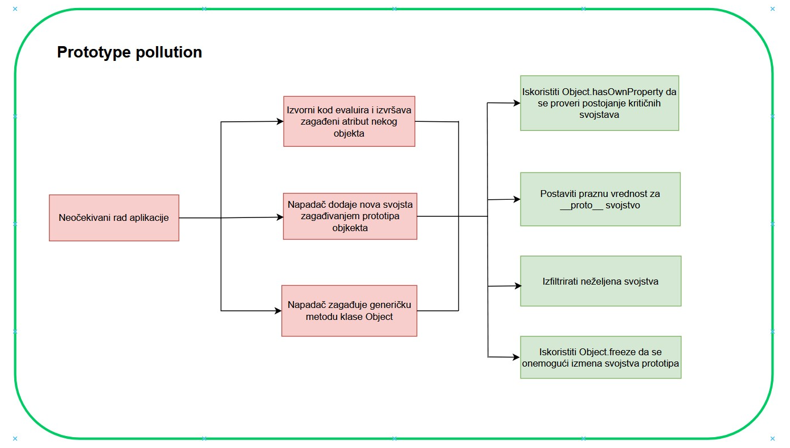

### Uvod
Setvalue je Type-safe biblioteka za čitanje, pisanje, ili proveru, ugnježdenih vrednosti objekta.
set-value je paket koji kreira ugnježdene vrednosti koristeći tačkastu notaciju ('a.b.c').

### Vulnerability(CVE-2019-10747)
CVE-2019-10747 je ranjivost povezana sa set-value JavaScript paketa, koja posebno utiče na verzije niže od 3.0.1. Ključni problem leži u bezbednosnom propustu poznatom kao Prototype Pollution. Ova ranjivost nastaje u funkciji mixin-deep paketa set-value, koja se može iskoristiti za dodavanje ili modifikaciju svojstava Object.prototipe koristeći različite korisne opterećenja kao što su konstruktor, prototip i proto. Iskorišćavanje ove ranjivosti omogućava napadačima da modifikuju prototip objekta, što potencijalno dovodi do dodavanja ili modifikacije postojećeg svojstva na svim objektima instanciranim iz tog prototipa​​​​​​​​.

Ova ranjivost je ocenjena sa osnovnom ocenom 9,8 od 10, klasifikovana kao KRITIČNA prema CVSS (Common Vulnerabiliti Scoring Sistem) verziji 3.k.

Izloženost ove ranjivosti prvenstveno leži u njenoj sposobnosti da dozvoli napadačima da manipulišu prototipom objekata u JavaScript-u, što može imati široko rasprostranjene efekte na aplikaciju. To može dovesti do nekontrolisane potrošnje resursa. Ovo se može manifestovati u različitim oblicima, uključujući mogućnost modifikacije postojećih svojstava, dodavanja novih svojstava i potencijalnog izvršavanja proizvoljnog koda, što dovodi do značajnog uticaja na poverljivost, integritet i dostupnost podataka i aplikacije.

### Attack - Exposure
Primarni problem za ovu ranjivost je to što može uticati na poverljivost i integritet podataka. Iskorišćavanjem ranjivosti Prototipe Pollution, napadač bi potencijalno mogao da promeni ponašanje aplikacije, što dovodi do problema kao što su krađa podataka, oštećenje podataka ili neovlašćena manipulacija podacima.

`
const parentObj = function() {
}

parentObj.prototype.log = function() {
    console.log("data logged to server")
}

const childObj = new parentObj()

console.log(childObj instanceof parentObj)
console.log(childObj instanceof Object)

console.log(childObj.__proto__ == parentObj.prototype)
console.log(childObj.__proto__.__proto__ == Object.prototype)

childObj.log()

parentObj.prototype.log = function() {
    console.log("Gotcha!")
}

childObj.log()
`

### Mitigation
Za programere koji koriste set-value paket je ključno da ažuriraju na verziju višu od 3.0.1 ili 2.0.1 kako bi ublažili ovu ranjivost.

Fix:
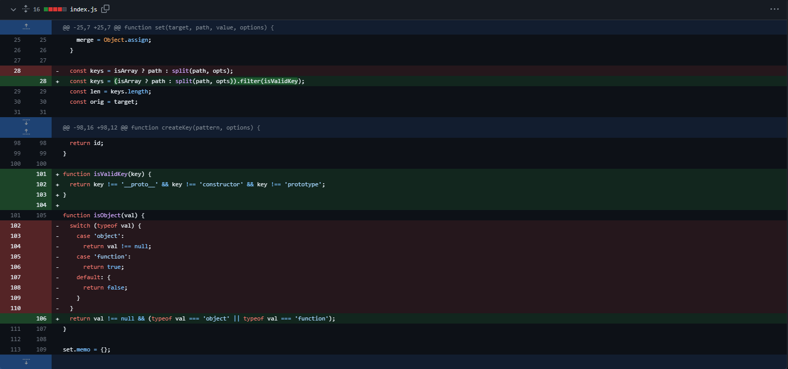
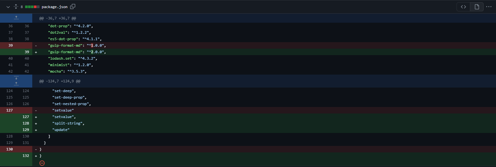
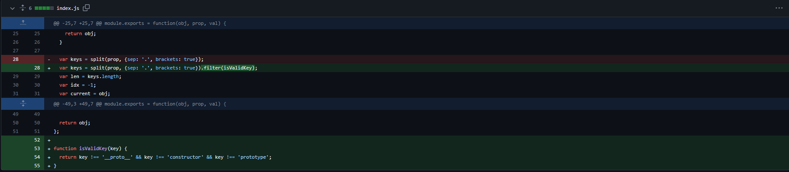
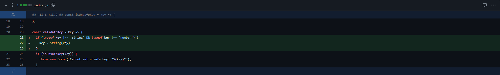
