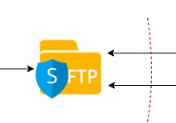
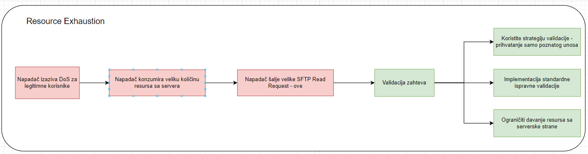
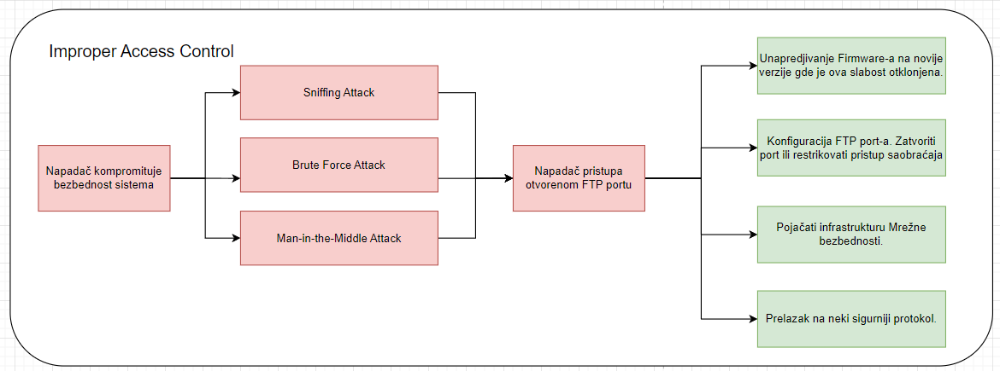
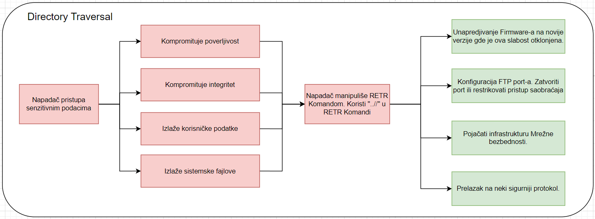

# Analiza ranjivosti, napada i mitigacija za Angular radni okvir

## Deo sistema koji se analizira

## FTP
Protokol za prenos datoteka (FTP) je standardni mrežni protokol koji se koristi za prenos računarskih datoteka između klijenta i servera na računarskoj mreži. 
FTP je izgrađen na arhitekturi klijent-server modela i koristi odvojene kontrolne i podatkovne veze između klijenta i servera. 
Korisnici FTP-a mogu da se autentifikuju pomoću protokola za prijavu sa čistim tekstom, obično u obliku korisničkog imena i lozinke, ali mogu da se povežu anonimno ako je server konfigurisan da to dozvoljava.

Jedna od ključnih karakteristika FTP-a je njegova sposobnost da efikasno i pouzdano prenosi datoteke, bez obzira na veličinu. 
Podržava binarni i ASCII prenos podataka i ima pasivni režim, koji je koristan za navigaciju kroz zaštitne zidove i prevođenje mrežnih adresa (NAT). 
Iako se FTP naširoko koristi za jednostavno deljenje datoteka i održavanje veb lokacija, on ima ograničenja u pogledu bezbednosti. 
Pošto prenosi podatke, uključujući akreditive za prijavu, bez šifrovanja, podložan je prisluškivanju i napadima čoveka u sredini. Kao rezultat toga, njegova upotreba je u velikoj meri dopunjena ili zamenjena sigurnijim protokolima kao što su FTPS (FTP Secure) ili SFTP (SSH File Transfer Protocol) u okruženjima koja su osetljiva na bezbednost.

## CVE-2023-3603 - Resource Exhaustion
Iscrpljenost resursa je vrsta ranjivosti gde su resursi sistema, kao što su CPU, memorija, prostor na disku ili propusni opseg mreže, iscrpljeni, što dovodi do smanjenih performansi ili potpunog uskraćivanja usluge (DoS). Ovo se može dogoditi kada je sistem preopterećen sa više zahteva ili procesa nego što može da podnese, često kao rezultat zlonamere, kao što je DoS napad. U takvim napadima, protivnik namerno šalje brojne zahteve ili izvodi radnje koje troše značajnu količinu sistemskih resursa, što dovodi do usporavanja ili potpunog ignorisanja legitimnih zahteva.

Ranjivosti iscrpljenosti resursa su posebno opasne jer se mogu iskoristiti relativno jednostavnim sredstvima, ali imaju potencijal da sruše čitave sisteme ili mreže. Oni ističu važnost pravilnog upravljanja resursima i potrebu za mehanizmima kao što su ograničavanje stope, kvote resursa i efikasni algoritmi za alokaciju resursa da bi se sprečili takvi problemi. Pored toga, sistemi za praćenje neobičnih aktivnosti mogu pomoći u ranom otkrivanju i ublažavanju ovih napada. Rešavanje iscrpljivanja resursa zahteva višeslojni pristup, kombinujući i preventivne mere i strategije reagovanja kako bi se obezbedila otpornost sistema i kontinuitet usluga.

### Vulnerability(CVE-2023-3603)
CVE-2023-3603 je ranjivost u obradi zahteva za čitanje od strane SFTP servera. To proizilazi iz nedostajuće provere alokacije koja može dovesti do NULL dereferenciranja kada je server u uslovima malo memorije. Konkretno, zlonamerni klijent može da zahteva SFTP čitanje do 4 GB, što dovodi do dodele slično velikih bafera. Ove alokacije nisu proverene na neuspeh, stvarajući značajan rizik

Nedostajuća provera alokacije u sftp serveru koji obrađuje zahteve za čitanje može da izazove NULL dereferencu u uslovima malo memorije. Zlonamerni klijent može da zahteva do 4GB SFTP čitanja, uzrokujući dodelu bafera do 4GB, koji se nije proveravao radi greške. Ovo će verovatno srušiti vezu sa sftp serverom provjerenih korisnika (ako se implementira kao račvanje kako je preporučeno). Za servere zasnovane na nitima, ovo takođe može izazvati DoS za legitimne korisnike.
S obzirom da se ovaj kod ne nalazi ni u jednoj objavljenoj verziji, nisu izdata nijedna bezbednosna izdanja.

Proizvod dodeljuje resurs za višekratnu upotrebu ili grupu resursa u ime aktera bez nametanja bilo kakvih ograničenja na veličinu ili broj resursa koji se mogu dodeliti, što predstavlja kršenje predviđene bezbednosne politike za tog aktera.

### Attack - Exposure
Kod često mora da radi sa ograničenim resursima, tako da programeri moraju paziti da se resursi ne troše prebrzo ili previše lako. Bez upotrebe kvota, ograničenja resursa ili drugih zaštitnih mehanizama, napadaču može biti lako da potroši mnogo resursa tako što će brzo uputiti mnogo zahteva ili prouzrokovati da se koriste veći resursi nego što je potrebno. Kada se dodeli previše resursa ili ako je jedan resurs prevelik, to može sprečiti ispravan rad koda, što može dovesti do uskraćivanja usluge.

Napadači mogu da iskoriste ovu ranjivost tako što brzo prave velike zahteve za čitanje, trošeći značajne resurse servera. Ovo može dovesti do uskraćivanja usluge (DoS) rušenjem veze sa SFTP serverom za autentifikovane korisnike. Na serverima implementiranim sa obradom zasnovanom na niti, to takođe može dovesti do DoS-a za legitimne korisnike, ometajući normalne operacije. Ključni problem leži u nemogućnosti sistema da nametne ograničenja na veličinu ili broj dodeljenih resursa, što krši predviđenu bezbednosnu politiku​​.

### Mitigation
- Pretpostavite da je svaki unos maliciozan. Koristite strategiju validacije "prihvati poznato dobro", odnosno koristite listu prihvatljivih unosa koja strogo odgovara specifikacijama. Odbacite svaki unos koji se ne pridržava strogo specifikacija ili ga transformišite u nešto što se pridržava.
- Prilikom izvršavanja validacije unosa, razmotrite sve potencijalno relevantne osobine, uključujući dužinu, tip unosa, ceo opseg prihvatljivih vrednosti, nedostajuće ili dodatne unose, sintaksu, konzistentnost među povezanim poljima i usaglašenost sa poslovnim pravilima. Na primer, "čamac" može biti sintaktički validan jer sadrži samo alfanumeričke karaktere, ali nije validan ako se očekuje unos koji sadrži samo boje poput "crvene" ili "plave".
- Ne oslanjajte se isključivo na traženje malicioznih ili neispravnih unosa. To će verovatno propustiti bar jedan nepoželjan unos, posebno ako se okruženje koda promeni. To može napadačima pružiti dovoljno prostora da zaobiđu nameravanu validaciju. Međutim, liste za odbacivanje mogu biti korisne za detekciju potencijalnih napada ili određivanje koji unosi su toliko pogrešni da treba da budu odbijeni izričito.
- Ublažavanje napada iscrpljivanjem resursa zahteva da ciljni sistem ili:
- Prvo od ovih rešenja samo po sebi predstavlja problem, jer može dozvoliti napadačima da spreče korišćenje sistema od strane određenog validnog korisnika. Ako napadač imitira validnog korisnika, može sprečiti korisnika da pristupi serveru u pitanju.
- Drugo rešenje može biti teško efikasno uspostaviti - i čak kada je pravilno urađeno, ne pruža potpuno rešenje. Jednostavno zahteva više resursa od strane napadača.
- Ako program mora da padne, osigurajte da padne graciozno (neuspeh zatvoren). Može biti iskušenje da se jednostavno dozvoli da program loše padne u slučajevima kao što su uslovi niske memorije, ali napadač može biti u mogućnosti da preuzme kontrolu pre nego što se softver potpuno isključi. Alternativno, nekontrolisani neuspeh može izazvati kaskadne probleme sa drugim nizvodnim komponentama; na primer, program može poslati signal nizvodnom procesu tako da proces odmah zna da je došlo do problema i ima bolju šansu za oporavak.
- Osigurajte da svi neuspesi u alokaciji resursa stave sistem u bezbedan položaj.
- Koristite postavke ograničenja resursa koje pruža operativni sistem ili okruženje. Na primer, pri upravljanju sistemskim resursima u POSIX-u, setrlimit() se može koristiti za postavljanje ograničenja za određene vrste resursa, a getrlimit() može odrediti koliko resursa je dostupno. Međutim, ove funkcije nisu dostupne na svim operativnim sistemima.
- Kada trenutni nivoi postanu blizu maksimuma koji je definisan za aplikaciju (vidi CWE-770), onda ograničite dodatnu alokaciju resursa privilegovanim korisnicima; alternativno, počnite sa oslobađanjem resursa za manje privilegovane korisnike. Iako ovo ublažavanje može zaštititi sistem od napada, to neće nužno zaustaviti napadače da negativno utiču na druge korisnike.
- Osigurajte da aplikacija izvodi odgovarajuće provere grešaka i rukovanje greškama u slučaju da resursi postanu nedostupni (CWE-703).

## CVE-2023-40708 - Improper Access Controll
Ranjivost nepravilne kontrole pristupa odnosi se na bezbednosnu slabost gde sistem ne uspeva da ograniči pristup svojim resursima na odgovarajući način. Ova vrsta ranjivosti se može manifestovati na različite načine, kao što su neobezbeđeni mrežni portovi, neadekvatne dozvole za datoteke ili neispravni mehanizmi autentifikacije.
Posledice takve ranjivosti mogu biti značajne, potencijalno omogućavajući neovlašćenim korisnicima da pristupe osetljivim podacima, menjaju konfiguracije sistema ili ometaju usluge.
Ovo može dovesti do kršenja podataka, gubitka integriteta podataka i može ugroziti ukupnu sigurnost sistema.
To je kritično pitanje jer direktno utiče na poverljivost, integritet i dostupnost resursa u informacionom sistemu.

### Uvod
SNAP PAC S1 Firmware je važna komponenta SNAP PAC S1 kontrolera.
SNAP PAC S1 Firmware je dizajniran za SNAP-PAC-S1 i SNAP-PAC-S1-FM kontrolere.
Ovi kontroleri su deo Opto 22's SNAP PAC Sistema, koji je skrojen za industrijska, proizvodna okruženja i okruženja za kontrolu procesa.
Firmware igra ključnu ulogu u funkcionalnosti i bezbednosti ovih kontrolera.

### Vulnerability(CVE-2023-40708)
CVE-2023-40708 je bezbednosna ranjivost povezana sa protokolom za prenos datoteka (FTP) u verziji firmvera SNAP PAC S1 R10.3b. Osnovni problem leži u tome što je FTP port podrazumevano otvoren. FTP, standardni mrežni protokol koji se koristi za prenos računarskih datoteka između klijenta i servera na računarskoj mreži, može postati bezbednosni rizik ako nije pravilno konfigurisan ili zaštićen. Otvoreni FTP port u ovoj specifičnoj verziji firmvera mogao bi nenamerno da otkrije datoteke uređaja, potencijalno omogućavajući neovlašćeni pristup.

### Attack - Exposure
Napadač bi mogao da iskoristi ovu ranjivost povezivanjem na otvoreni FTP port. Pošto FTP inherentno ne uključuje robusne bezbednosne karakteristike, kao što je šifrovanje, može biti podložan raznim vrstama napada kao što su njuškanje, gruba sila ili napadi čoveka u sredini. Posledice takve eksploatacije mogu uključiti neovlašćen pristup osetljivim datotekama, manipulaciju podacima ili čak dalju eksploataciju ranjivosti mreže. Priroda napada u velikoj meri zavisi od namere napadača i specifične konfiguracije mreže, ali otvoreni FTP port u suštini služi kao kapija za neovlašćeni pristup.

### Mitigation
Da biste ublažili ovu ranjivost, treba razmotriti nekoliko ključnih koraka:

Ažuriranje firmvera: Ako je proizvođač objavio ažuriranu verziju firmvera koja rešava ovu ranjivost, nadogradnja na ovu noviju verziju je primarni korak.
Konfigurisanje FTP postavki: Ako ažuriranje firmvera nije odmah izvodljivo, ponovno konfigurisanje FTP podešavanja za zatvaranje porta ili ograničavanje pristupa može biti privremeno rešenje.
Mere mrežne bezbednosti: Primena robusnih bezbednosnih mera mreže kao što su zaštitni zidovi, sistemi za otkrivanje/prevenciju upada i redovne bezbednosne revizije mogu pomoći u zaštiti od takvih ranjivosti.
Bezbednost protokola: U širem smislu, zamena FTP-a sigurnijim protokolima kao što su SFTP (SSH File Transfer Protocol) ili FTPS (FTP Secure), koji obezbeđuju šifrovanje, može značajno da smanji takve rizike.

## CVE-2015-7601 - Directory Traversal Vulnerabilities
Ranjivosti u prelasku preko direktorijuma, takođe poznate kao ranjivosti u obilasku putanje, su bezbednosni nedostaci u veb aplikacijama ili serverima koji omogućavaju napadačima da pristupe datotekama i direktorijumima koji su uskladišteni izvan predviđene korenske fascikle veba. Ove ranjivosti se javljaju kada aplikacija ne dezinfikuje na odgovarajući način korisnički unos, dozvoljavajući napadačima da manipulišu promenljivim koje upućuju na datoteke sa sekvencama „..“ (tačka-tačka-kosa crta). Ovo potencijalno može dovesti do neovlašćenog pristupa osetljivim datotekama, uključujući konfiguracione datoteke, izvorni kod i druge kritične sistemske datoteke. Ove ranjivosti su posebno opasne jer se mogu iskoristiti za čitanje ili manipulisanje datotekama na serveru, što dovodi do krađe podataka, kompromitovanja servera ili daljih napada na mrežu. Rešavanje ovih ranjivosti obično uključuje implementaciju odgovarajuće provere valjanosti unosa i kontrole pristupa datotekama u kodu aplikacije.

### Uvod
PCMan-ov FTP server je lagan softver za FTP server koji je prilagođen korisniku dizajniran za Vindovs operativne sisteme. Poznat je po svojoj jednostavnosti i lakoći korišćenja, što ga čini popularnim izborom za brzo podešavanje i primenu FTP usluga u manje zahtevnim okruženjima. Ovaj softver se često bira za male ili lične projekte zbog svoje jednostavne konfiguracije i minimalnih zahteva za resursima. Međutim, kao i mnoge softverske aplikacije, on je tokom vremena bio podložan raznim bezbednosnim ranjivostima, kao što je CVE-2015-7601 ranjivost prilikom obilaska direktorijuma. Ovo naglašava važnost redovnog ažuriranja i nadgledanja takvog softvera radi bezbednosnih zakrpa i poboljšanja.

### Vulnerability (CVE-2015-7601)
Ranjivost u obilasku direktorijuma u ​​PCMan-ovom FTP serveru 2.0.7 omogućava udaljenim napadačima da čitaju proizvoljne datoteke koristeći „..//“ (tačka dupla kosa crta) u RETR komandi. Ova komanda, koja se obično koristi za preuzimanje datoteka sa servera, kada se njome manipuliše sekvencama prelaska, može dovesti do neovlašćenog pristupa osetljivim datotekama. Takav pristup ugrožava poverljivost i integritet sistema, potencijalno otkrivajući korisničke podatke, sistemske datoteke ili drugu kritičnu imovinu.

### Attack - Exposure
Ova ranjivost proizilazi iz neadekvatne sanacije korisničkih unosa, omogućavajući znakovima za prelazak putanje datoteke kao što je „..//“ da manipulišu strukturom direktorijuma servera. Napadači, koji zahtevaju samo osnovnu autentifikaciju, mogu ovo da iskoriste slanjem modifikovane RETR komande, kao što je RETR ..//..//..//etc/passvd, sa ciljem da pristupe datotekama izvan osnovnog direktorijuma servera. Uspešna eksploatacija bi mogla da otkrije osetljive informacije, detalje o korisničkom nalogu ili dalje sistemske ranjivosti. Javno objavljeno 29. septembra 2015., ranjivost je zabrinjavajuća zbog svoje lakoće eksploatacije i potencijala za daljinsko pokretanje.

### Mitigation
Da biste ublažili ovu ranjivost, preporučuju se sledeći koraci:

Patchevi: Primenite patcheve ili ažuriranja od dobavljača softvera. Pošto je CVE-2015-7601 dobro dokumentovan, prodavci su verovatno objavili ispravke.

Konfiguracija i kontrole pristupa: Implementirajte snažne mehanizme autentifikacije i ograničite pristup serveru. Pravilna konfiguracija servera je ključna za minimiziranje rizika.

Redovne revizije bezbednosti: Redovno obavljajte bezbednosne revizije i procene ranjivosti da biste identifikovali i otklonili poznate i potencijalne bezbednosne probleme.

Mrežna bezbednost: Koristite bezbednosne alate na nivou mreže kao što su zaštitni zidovi i sistemi za otkrivanje upada da nadgledate i blokirate zlonamerne aktivnosti.